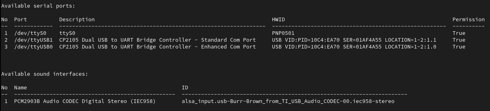
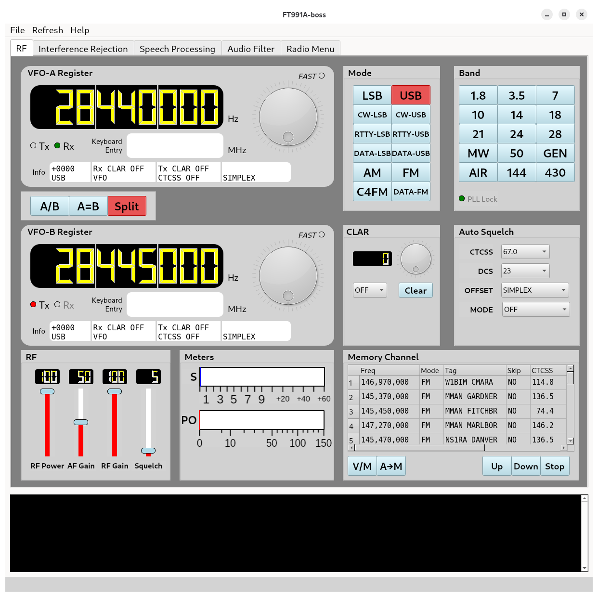
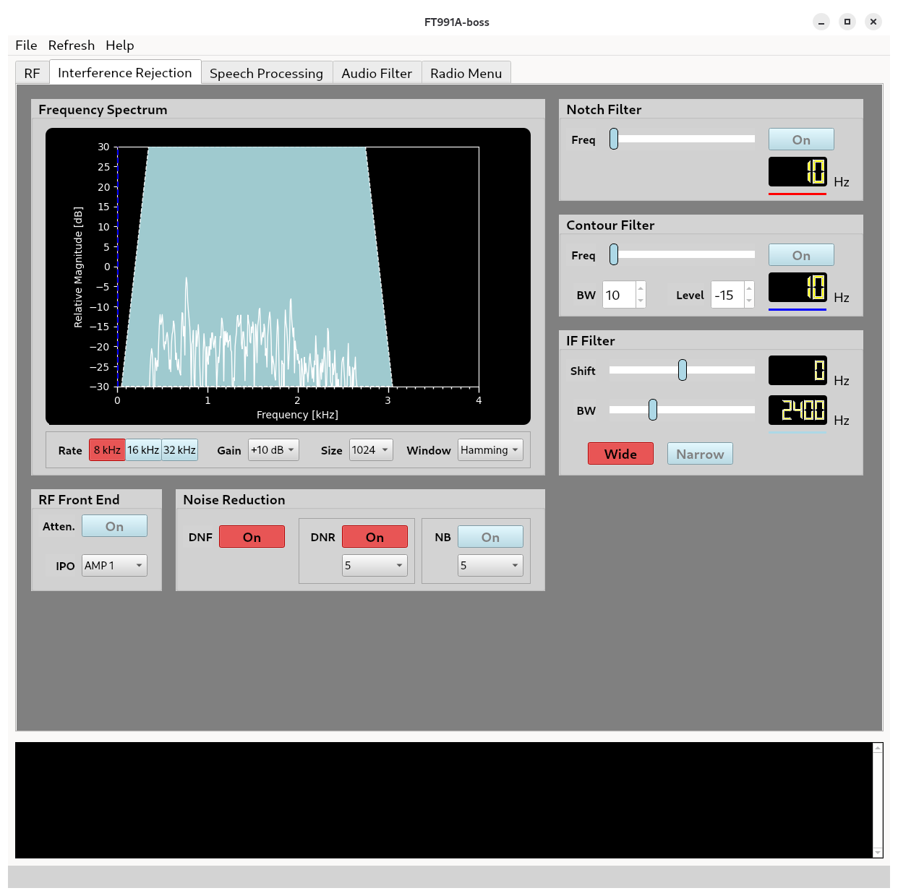
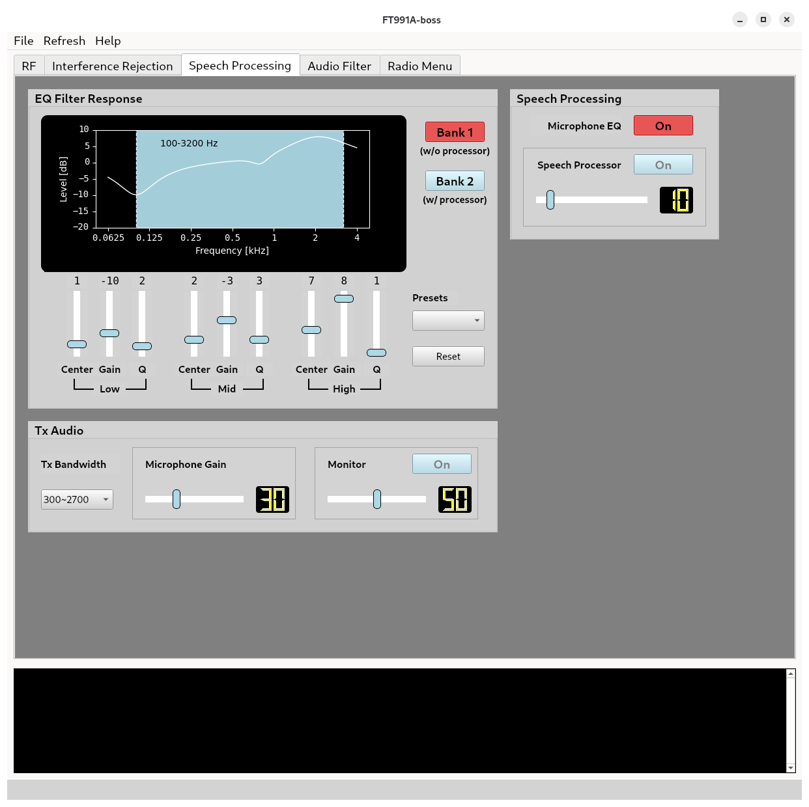
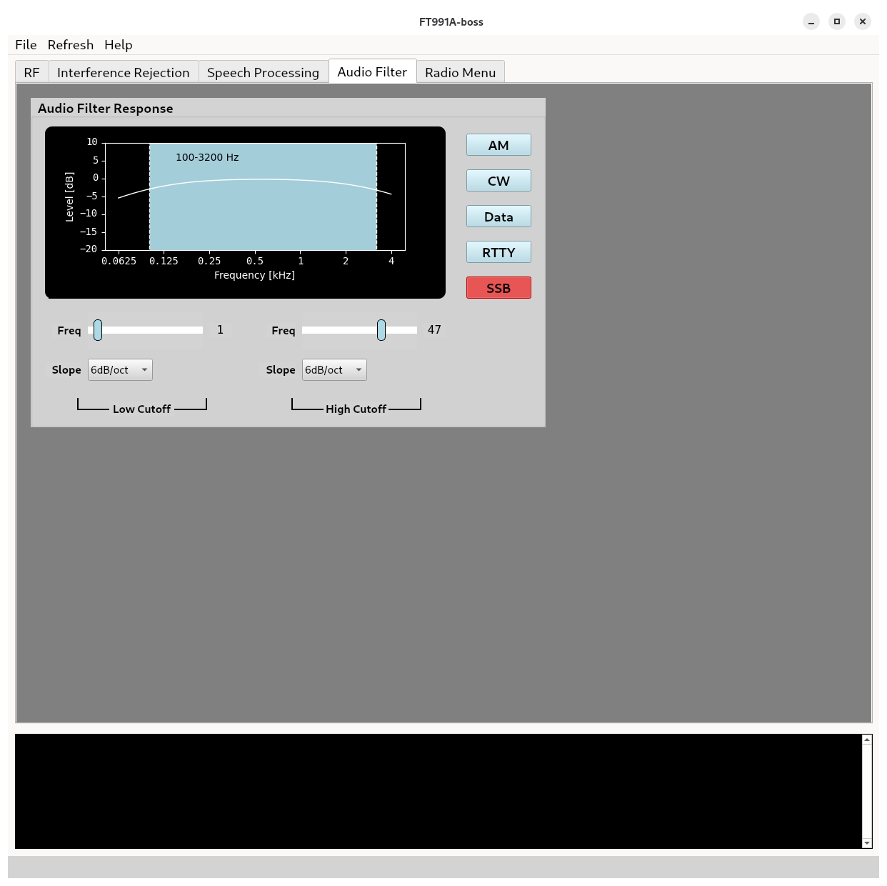
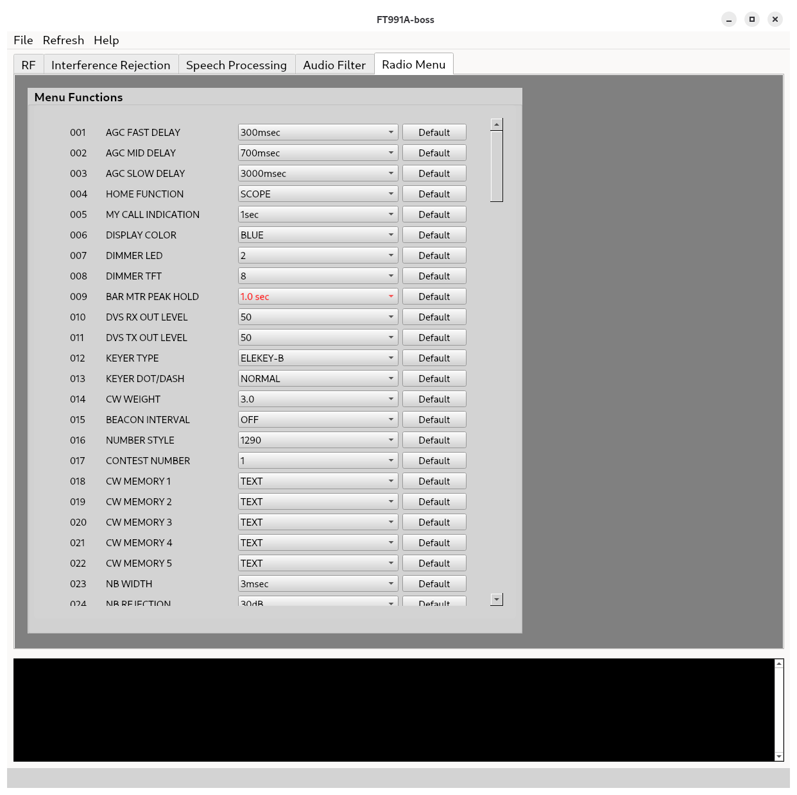

# ft991a-boss

## Introduction

`ft991a-boss` is a computer program written in Python for controlling the **YAESU FT-991A** all-mode transceiver. Using this program, you can change a wide range of transceiver parameters, including:

- Frequency
- Modulation mode
- Repeater shift
- CTCSS tone and DCS code
- RF output power
- IF filter settings
- Notch and contour filters
- Audio equalizer settings
- Receiver audio filter

The program was developed using **Python 3.9** under **Linux**. The reference platform was **RHEL 9.7**, although it should run on other Linux distributions with little or no modification, provided that all dependencies are satisfied.

The software has **not been tested** on Microsoft Windows or macOS.

:information_source:
**Information:** Following radio firmware was used during the development:
| Firmware    | Version |
|-------------|---------|
| Main        | V02-07  |
| DSP         | V01-12  |
| TFT         | V02-00  |
| C4FM        | V04-15  |


'Radio' and 'Transceiver' words are used interchangeably throughout this README.md file.

---

## Memory and Menu Support

The program supports saving and loading:

- Radio menu settings  
- Memory channels  

While the radio menu settings are well documented, the official FT-991A memory-channel read/write commands do not support all settings that are saved when the **A→M** button on the front panel is pressed. To overcome this limitation, the software uses **raw memory read/write functions** for the memory-channel operations based on the work of **Gil Kloepfer**. For more background information and protocol details, please refer to https://www.kloepfer.org/ft991a/ 

Note that the raw read/write commands are only used during memory-channel operations. All other controls are performed using commands documented in FT-991A CAT Operation Reference Manual, YAESU, 2017.

:warning:
**Warning:** The raw write function must be used with extreme care. Writing to an incorrect NVRAM address may render your transceiver inoperable or seriously degrade its performance. By default, program's `spw` (raw write) function writes only to NVRAM addresses used by memory channels.

:bulb:
**Tip:** If you are planning to experiment with the `spw` command, it is strongly recommended that the radio's NVRAM content is first saved using `--dumpram` command-line argument in case you need to verify it later.

---

## Future Improvements

The following items are planned for future improvements:

- Add controls for CW
- Explore possibility of pandapter or SDR support
- Add controls for QSO logging
- Test the software on Microsoft Windows & macOS

---

## Installation and Starting the Program

### Dependencies

Following are the modules and their versions used by the software:

| Module      | Version |
|-------------|---------|
| numpy       | 2.0.2   |
| xlrd        | 2.0.2   |
| PySide6     | 6.10.1  |
| SoundCard   | 0.4.5   |
| matplotlib  | 3.9.4   |
| pyserial    | 3.5     |

---

### Setting up a Virtual Environment

It is advisable to setup a virtual Python environment to use the program. This allows that the dependencies are isolated from rest of the user area. To setup a virtual environment, proceed as follows:

```bash
python -m venv <venv_name>
source <venv_name>/bin/activate
pip install --upgrade pip
pip install numpy
pip install xlrd
pip install PySide6
pip install SoundCard
pip install matplotlib
pip install pyserial
```

Replace `<venv_name>` with the desired environment name (typically a hidden directory such as `.venv01`).

---

## Running the Program

Be sure that the virtual Python environment is activated if you are using one.

### Step 1 – Connect the transceiver

Connect the FT-991A to your computer via USB and power it on.

- No special USB drivers are required on Linux.  
- Use a **high-quality USB cable with RF chokes**.

---

### Step 2 – Baud rate

The default baud rate is **38400**.  
Ensure that the transceiver's baud rate is set to the same value (031 CAT RATE).

---

### Step 3 – List available devices

```bash
ft991a_boss.py --listcom --listsound
```

You should see output similar to the following:



If your transceiver is recognized properly, you should see:
- One standard COM port  
- One enhanced COM port (use this one)  
- One audio interface  

The permissions for the serial ports should indicate `True`, meaning you have write access. In Linux, this is typically achieved by adding the current user to the `dialout` group. Running the program as `root` is not recommended. You should choose the enhanced COM port for the control interface.

---

### Step 4 – Start the GUI

```bash
ft991a_boss.py -cid <control_id> -sid <sound_id>
```

Example:

```bash
ft991a_boss.py -cid 3 -sid 1
```

---

### QWidgets Application Arguments

Program also supports passing QWidgets application arguments. These arguments are given in addition to the arguments that `ft991a_boss.py` is using. Please refer to QWidgets documentation for more details.

As an example, you can choose Windows or Fusion style widgets using the following arguments:

**Windows** style:
```bash
ft991a_boss.py --style windows
```

**Fusion** style:
```bash
ft991a_boss.py --style fusion
```

---

## Graphical User Interface Overview

The program provides a graphical user interface (GUI) in which transceiver control functions are grouped into tabs according to their functionality. This organization helps reduce visual clutter and makes related controls easier to locate.

The program comes with two different GUI layouts: vertical and horizontal. You can choose between the two layouts by importing the correct module:

**Normal** layout (default):
```python
from ft991a_ui import Ui_MainWindow
```

**Wide** layout:
```python
from ft991a_wide_ui import Ui_MainWindow
```

Most widgets provide additional information via tooltips. To view the tooltip for a widget, simply hover the mouse cursor over it and wait a few seconds.

All slider and knob controls support keyboard-based adjustment:

- **Cursor Up / Down**: fine adjustment  
- **Page Up / Down**: faster adjustment  

To use the keyboard, first set focus on the desired widget by right-clicking on it.

:information_source:
**Information:** Not all control widgets are available at all radio modes. 

### Debug Message Window

The GUI also has a message window that displays data traffic between the software and the transceiver. This is especially useful for debugging and for users who want to extend the software by adding custom commands.

---

## Program Menus

The program includes two menu sections located under the title bar:

- **File**
- **Refresh**

Each menu is described below.

---

### File Menu

The **File** menu contains commands for saving and loading transceiver configuration data, including:

- Radio menu settings
- Memory channels

These functions allow transceiver settings to be stored and restored at a later time.

All data files are saved in **XML text format** and may be edited using a text editor if needed.

:bulb:
**Tip:** Consider saving both radio menu and memory channels when you first start the program.

Each memory-channel entry includes a **checksum** to ensure data integrity, as memory data is written directly to the transceiver using raw memory write commands. Memory channels may be reordered or renumbered manually in the XML file, provided that each channel is moved as a complete block together with its checksum.

Radio menu settings may also be edited directly in the XML file, as long as the values remain within the allowable range defined by the transceiver. Before sending any menu data to the transceiver, the software validates all values against the allowable set and ignores invalid entries.

:information_source:
**Information:** Loading memory channels from disk is a slow process due to the large number of bytes that need to be written to the radio.

---

### Refresh Menu

The **Refresh** menu provides commands to synchronize the GUI with the current transceiver state. 

Under normal operation, manual refresh is not required as long as all transceiver parameters are adjusted through the GUI. The program also performs automatic refresh operations when certain triggers occur. The program does not use `ai` (auto information) feature of the transceiver.

If the transceiver is adjusted directly using the front panel, some GUI controls may become out of sync. In such cases, the commands in this menu can be used to force a refresh and restore consistency between the GUI and the transceiver.

---

## Program Tabs

The software divides transceiver control functions into multiple tabs, each corresponding to a specific functional area (e.g., RF control, interference rejection, speech processing). This approach keeps related controls grouped together while maintaining a clean and manageable interface.

---

## RF Tab

The **RF** tab contains widget groups for the following functions:

- Two frequency registers (VFO-A and VFO-B)  
- Register swap operations (A/B, A=B, Split)  
- RF settings (RF power, RF gain, manual squelch, AF gain)  
- Clarifier (shift and mode)  
- Meters (S-meter and PO meter)  
- Auto squelch (CTCSS, DCS, offset)  
- Band selection  
- Operating mode selection  
- Memory channel display and operations  



Each frequency register supports independent adjustment and displays associated register information. Frequency can be changed using either:

- The tuning dial widget next to the frequency display, or  
- The keyboard input field below the display  

The keyboard input supports **relative frequency entry** when a sign is used. For example:

- Entering `+0.003` shifts the frequency by +3 kHz  
- Entering `28.3` sets the frequency to 28.3 MHz  

All frequency entries are specified in **MHz**. You can also copy-and-paste a frequency text as shown in DXCluster&reg; in this field.

The meter group displays signal strength (**S**) and output power (**PO**) meters. Both meters have red indicators that show peak values. Note that the signal strenth indicator can be inaccurate for very large RF input powers particularly on FM mode.

The memory group displays the currently active memory channels retrieved from the transceiver using raw memory read commands. Memory data is written back using raw memory write commands.

To use memory functions:

1. Select a memory channel using the mouse  
2. Press **A→M** to store the current VFO-A settings into the selected memory  
3. Press **A/M** to toggle between VFO and memory mode

:information_source:
**Information:** Program won't be able to store memory channels if the radio is on the **M-LIST** screen (i.e., displaying the memory channels). In order to be able to store memory channels using the program, exit from the **M-LIST** screen using the **BACK** soft-button.

If memory channel data is modified directly from the transceiver front panel (e.g., changing a memory tag), the memory table can be refreshed using **Refresh → Memory Channel**.

Memory channels may be saved and loaded using:

- **File → Save Memory Channel**  
- **File → Load Memory Channel**

Entering split-memory data (different Rx and Tx frequencies) requires simultaneous operation of the **PTT** and **A→M** buttons while the transceiver is in memory mode (see FT-991A Operating Manual, page 109). This operation is currently supported only through the transceiver front panel.

The program also supports memory scanning using the provided controls.

:information_source:
**Information:** In rare cases, the transceiver can get stuck on a memory channel while switching between memory and VFO modes. This is a temporary state. To revert to the normal operation, proceed as follows using the front panel of the transceiver:

1. Press **V/M** to enter the memory mode
2. Go to memory channel #1 using **F(M-LIST)**→**MCH**→**MULTI DIAL**
3. Enter the memory-tune mode by moving the VFO dial
4. Press **V/M** to leave the memory-tune mode
5. Press **V/M** again to leave the memory mode

---

## Interference Rejection Tab

The **Interference Rejection** tab contains widget groups for the following functions:

- Notch filter frequency  
- Contour filter (frequency, bandwidth, level)  
- IF filter (shift, bandwidth, type)  
- RF front-end attenuation and amplification (IPO)  
- Noise reduction (digital noise filter, noise reduction, noise blanking)  



These controls provide powerful tools for reducing interference during reception, as described in the FT-991A Operating Manual (pages 47–56).

This tab also includes a **real-time spectrum display** of the received signal. The spectrum is overlaid with the notch, contour, and IF filter parameters, allowing users to visually observe how filter adjustments affect the signal.

For example:

- Adjusting the notch filter frequency moves a vertical indicator line
- Changing IF filter bandwidth/shift modifies the simulated filter response

Most interference rejection functions apply to **SSB, CW, RTTY, DATA,** and **AM** modes. These features are generally not available in **FM** mode.

:information_source:
**Information:** The FFT parameters are used exclusively for visualization of the spectrum and do **not** affect signal demodulation.

---

## Speech Processing Tab

The **Speech Processing** tab contains widget groups for:

- Two equalizer filter banks (frequency, gain, bandwidth per section)  
- Speech processor (state and level)  
- Transmit audio settings (Tx bandwidth and microphone gain)  



Each equalizer filter-bank is modeled by cascade connection of three peaking-filter sections. Each filter section provides adjustable center frequency, gain, and bandwidth, as defined in the FT-991A Operating Manual (page 67).

As parameters are adjusted, changes are applied to the transceiver in real time and the corresponding filter response is displayed graphically.

To evaluate the effect of speech processing and equalization, users may enable the transceiver’s internal monitor function (see FT-991A Operating Manual, pages 65 and 74).

:information_source:
**Information:** Microphone equalizer button must be turned on to see effect of the equalizer.

Several preset equalizer configurations are also provided for experimentation.

---

## Audio Filter Tab

The **Audio Filter** tab provides controls for the adjustable receiver audio filters.



There are five different filter sets corresponding to each operating mode. Each filter set provides adjustable low-cutoff frequency, high-cutoff frequency, and slope. Furthermore, each filter set is modeled by cascade connection of a low-pass filter and a high-pass filter. The slope parameter determines the filter order. 

Filter parameter ranges depend on the selected operating mode, as documented in the FT-991A Operating Manual (page 60). Users can select the appropriate parameter set by pressing the corresponding mode buttons on the screen. Changes are applied in real time and the resulting filter response is displayed graphically.

:information_source:
**Information:** Selecting a mode on this tab **does not change the transceiver’s operating mode**. It only selects the correct audio filter parameter set from the transceiver menu. If the transceiver is switched to that mode later, the associated filter settings will automatically be used.

---

## Radio Menu Tab

The **Radio Menu** tab provides access to all transceiver menu parameters in a scrollable table.



Allowable values for each menu item are presented using drop-down selection boxes. If a parameter differs from its default value, it is displayed in **red**.

Pressing the **Default** button on a row restores that parameter to its factory default value.

If menu settings are modified directly from the transceiver front panel, the table can be refreshed using **Refresh → Radio Menu**.

Transceiver menu parameters may be saved and loaded using:

- **File → Save Radio Menu**  
- **File → Load Radio Menu**


